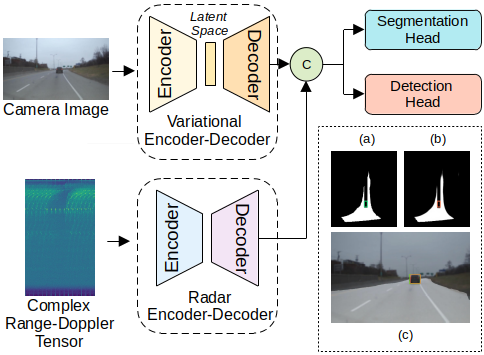
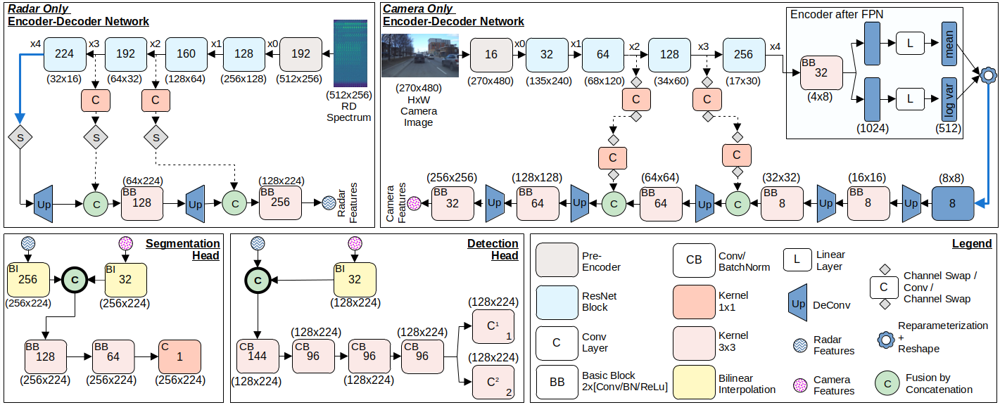
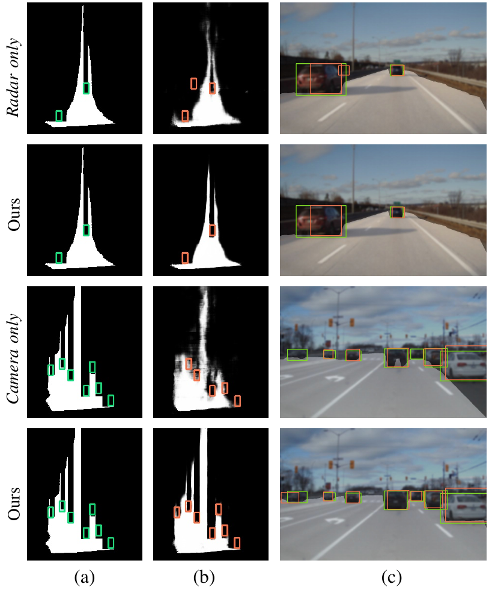
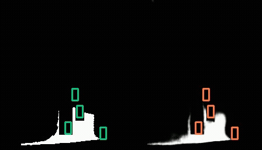

# REFNet++: Multi-Task Efficient Fusion of Camera and Radar Sensor Data in Bird’s-Eye Polar View

## News
- **(2025/07/01)** Accepted to IEEE ITSC 2025!

## Overview
The variational encoder-decoder architecture learns the transformation from the front-view camera image to BEV, which corresponds to the Range-Azimuth (RA) domain. On the other hand, the radar encoder-decoder architecture learns to recover the angle information from the complex Range-Doppler (RD) input, producing RA features. Free space segmentation and vehicle detection are performed on the resulting features fused by concatenation by the appropriate heads. (a) ground truth labels, (b) prediction results, and (c) predictions projected onto the camera image.

<p align="center">
  
</p> 

## Abstract
A realistic view of the vehicle’s surroundings is generally offered by camera sensors, which is crucial for environmental perception. Affordable radar sensors, on the other hand, are becoming invaluable due to their robustness in variable weather conditions. However, because of their noisy output and reduced classification capability, they work best when combined with other sensor data. Specifically, we address the challenge of multimodal sensor fusion by aligning radar and camera data in a unified domain, prioritizing not only accuracy, but also computational efficiency. Our work leverages the raw range-Doppler (RD) spectrum from radar
and front-view camera images as inputs. To enable effective fusion, we employ a variational encoder-decoder architecture that learns the transformation of front-view camera data into the Bird’s-Eye View (BEV) polar domain. Concurrently, a radar encoder-decoder learns to recover the angle information from the RD data that produce Range-Azimuth (RA) features. This alignment ensures that both modalities are represented in a compatible domain, facilitating robust and efficient sensor fusion. We evaluated our fusion strategy for vehicle detection and free space segmentation against state-of-the-art methods using the RADIal dataset.

## Fusion Architecture
The input to the radar only network is the range-Doppler (RD) data, while the camera only network intakes front-view camera images. x0 to x4 are the feature maps from the respective encoder blocks. The encoder is connected to the decoder by a thick blue arrow, by which the encoded features are upscaled to higher resolutions. The skip connections are shown as dotted lines that preserves the spatial information. The radar and camera features are fused by concatenation on the subsequent heads. Predictions are in Bird’s Eye RA Polar View.

<p align="center">
  
</p>

The models are trained and tested on the [RADIal dataset](https://github.com/valeoai/RADIal/tree/main). The dataset can be downloaded
[here](https://github.com/valeoai/RADIal/tree/main#labels:~:text=Download%20instructions). Our model is located under `pretrainedmodel/refnetplusplus.pth`.

## Model Predictions
Qualitative results on samples from the test set. (a) depicts the ground truth labels in Bird’s-Eye Polar View where the free space segmentation is in white while the BEV bounding boxes are in green. (b) are our prediction results. For a better visualization, the bounding box predictions are projected onto the camera images as shown in (c), with the ground-truth boxes. The free space predictions are projected by consolidating the intensity values.

<p align="center">
  
</p>

## Setting up the virtual environment
### Requirements
All the codes are tested in the following environment:
- Linux (tested on Ubuntu 22.04)
- Python 3.9

### Installation
0. Clone the repo and set up the conda environment:
```bash
$ git clone "this repo"
$ conda create --prefix "your_path" python=3.9 -y
$ conda update -n base -c defaults conda
$ conda activate "your_path"
```

1. The following are the packages used:
```bash
$ conda install pytorch==1.12.1 torchvision==0.13.1 torchaudio==0.12.1 cudatoolkit=11.3 -c pytorch
$ pip install -U pip
$ pip3 install pkbar
$ pip3 install tensorboard
$ pip3 install pandas
$ pip3 install shapely
$ pip3 install jupyter
$ pip3 install pickleshare
$ pip3 install opencv-python
$ pip3 install einops
$ pip3 install timm
$ pip3 install scipy
$ pip3 install scikit-learn
$ pip3 install polarTransform
$ pip3 install matplotlib
$ pip3 install numpy==1.23
```
## Running the code

### Training
Run the following to train the model. Please check the `config/config_fusion.json` before training. REFNet++ in multi-tasking model will be chosen by default.
```bash
$ python 1-Train.py
```
### Evaluation
To evaluate the model performance, please load the trained model and run:
```bash
$ python 2-Evaluation.py
```
### Testing
To obtain qualitative results, please load the trained model and run:
```bash
$ python 3-Test.py
```
You should be able to see such a video:

<p align="left">
  
  
</p>


### Computational complexity
To compute Frames Per Second (FPS), please load the trained model and run:
```bash
$ python 4-FPS.py
```

## Conclusion and Further research
- We proposed REFNet++, a fusion architecture that performs multitasking and can also operate in a single task mode, designed to boost the computational efficiency of the camera-radar perception system. 
- In line with our research goal and the results demonstrated on the RADIal dataset, our method exhibits excellent trade-off between performance while retaining a comparatively low computing power.
- Our code can be extended for further analysis, for example to include LiDAR data.
- We plan to further accelerate this research using other fusion datasets.

## Acknowledgments
- Thanks to Elektrobit Automotive GmbH and Mobile Perception Systems Lab from Eindhoven University of Technology for their continous support.
- This project is an extended version of [REFNet](https://github.com/tue-mps/refnet/).

## License
The repo is released under the BSD 3-Clause License.
